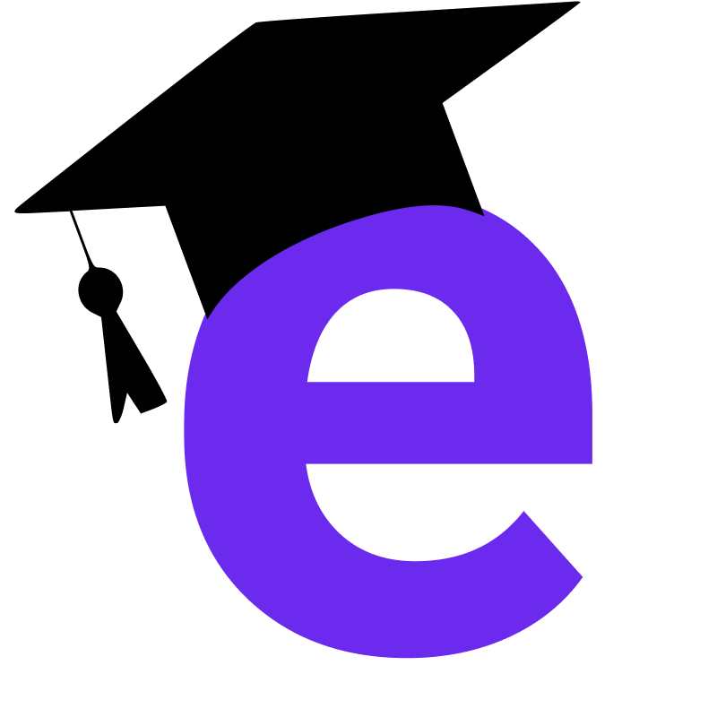

<h1 align="center">
   
</h1>



## Menu

[Sobre o projeto](#book-sobre-o-projeto)

[Tecnologias](#rocket-tecnologias)

[Preview](#eyes-preview)

[Como rodar localmente](#fire-como-rodar-localmente)

[Como contribuir](#gear-como-contribuir)

[Contato](#mailbox-contato)

[Siga-me ](#siga-me)

<br>

# :book: Sobre o projeto
Esse projeto está sendo desenvolvido durante a 2ª edição da bootcamp [Multi Stack](https://lp.treinaweb.com.br/multi-stack/aula1), evento organizado pela [Treina Web](https://www.treinaweb.com.br)<br />
<h4 align="center"> :construction: In development :construction:</h4>
Foi pensado para conectar os alunos que estão a procura de um profissional para ajuda-lo em suas dificuldades em disciplinas escolares, para aprender a tocar um instrumento ou um novo idioma.
---

# :rocket: Tecnologias
Este projeto foi desenvolvido com as seguintes tecnologias:
## Frontend Web
- [ReactJS](https://pt-br.reactjs.org)
- [Typescript](typescriptlang.org/)
- [NextJS](https://nextjs.org)
- [Bootstrap](https://getbootstrap.com.br)
- [Emotion](https://emotion.sh/docs/introduction)
- [Axios](https://axios-http.com/docs/intro)

## Backend
- [PHP](https://www.php.net)
- [Laravel](https://laravel.com)

## Mobile
- [Axios](https://axios-http.com/docs/intro)
- [Expo](https://expo.dev)
- [Expo Location](https://docs.expo.dev/versions/latest/sdk/location)
- [Stack Navigator](https://reactnavigation.org/docs/stack-navigator/)

---

# :eyes: Preview

---

# :earth_americas: Implantação em produção
### Back-end: <br />
### Front-end WEB: [Netlify](https://e-prof.netlify.app)<br />

# :fire: Como rodar localmente
## :white_flag: Condições prévias
Você precisa ter instalado:

- NodeJS
- JAVA 11
- Package manager (NPM ou Yarn)

## 💾 Clone esse repositório

```bash
$ git clone https://github.com/ojeffpinheiro01/e-prof.git
```

## 📁 Entre na pasta

```bash
$ cd e-prof
```

## 🔧 Instale as dependências

```bash
cd backend && yarn install
cd frontend && yarn install
```


## 🌐 Rodando o servidor BACKEND

- Instale e configure o banco de dados sqlite

- Entre na pasta 'backend'
```bash
cd backend
```

- Instale a aplicação 
```bash
laravel new
```

- Inicie o servidor 
```bash
php artisan serve
```

## :computer: Rodando o FRONT-END
Entre na pasta

```bash
$ cd frontend
```

Rode a aplicação

```bash
$ yarn start
```
---
## :iphone: Rodando no seu smartphone
## Condição prévia 
- Você precisa já ter instalado o Aplicativo do Expo no seu smartfone
<h3 align="center">
  <a href="https://apps.apple.com/app/apple-store/id982107779">
    
  </a>
  <a href="https://play.google.com/store/apps/details?id=host.exp.exponent&referrer=www">
    
  </a>
 </h3>
 
 
 - Abra o Expo 
 - Clique para scanear o QR Code 
 - Aponte o celular para o QR Code abaixo:
 <h3 align="center">
  
</h3>
---

# :gear: Como contribuir
```bash
- Faça um fork desse repositório;
- Crie uma branch com a sua feature: git checkout -b minha-feature;
- Faça commit das suas alterações: git commit -m 'feat: Minha nova feature';
- Faça push para a sua branch: git push origin minha-feature;
```

---

# :mailbox: Contato	
[](https://www.linkedin.com/in/jeferson-pinheiro/)
[](mailto:jefersonpinheirodesouza@gmail.com)

# Siga-me 
<p align="center">
<a href="https://dev.to/ojeffoinheiro" target="blank"></a>
<a href="https://codepen.io/ojeffoinheiro" target="blank"></a>
<a href="https://linkedin.com/in/jeferson-pinheiro" target="blank"></a>
<a href="https://stackoverflow.com/ojeffpinheiro" target="blank"></a>
<a href="https://codesandbox.io/u/ojeffoinheiro" target="blank"></a>
<a href="https://app.rocketseat.com.br/me/jeferson-pinheiro-de-souza-1580117763" target="blank"></a>
</p>

---

>Este projeto foi desenvolvido com ❤️ por **[Jéferson Pinheiro](https://github.com/ojeffpinheiro01/)**, com os instrutores **[Akira Hanashiro](https://github.com/hanashiro)** e **[Elton Fonseca](https://github.com/elton-fonseca)** durante a **[Multi Stack](https://lp.treinaweb.com.br/multi-stack/aula1)<br> 
Se te ajudou, dá ⭐, vai me ajudar também 😉
